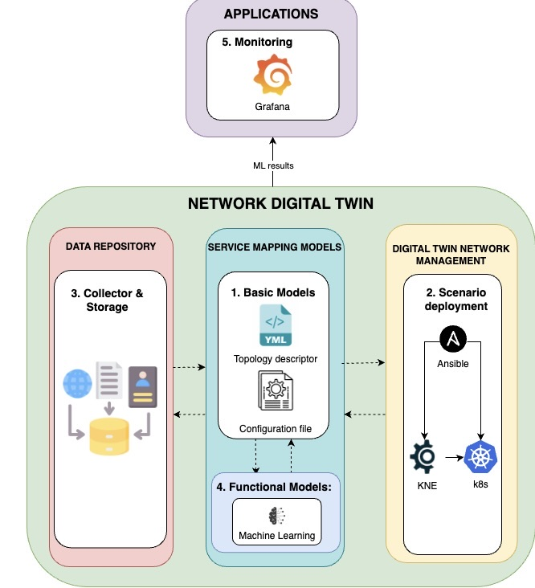
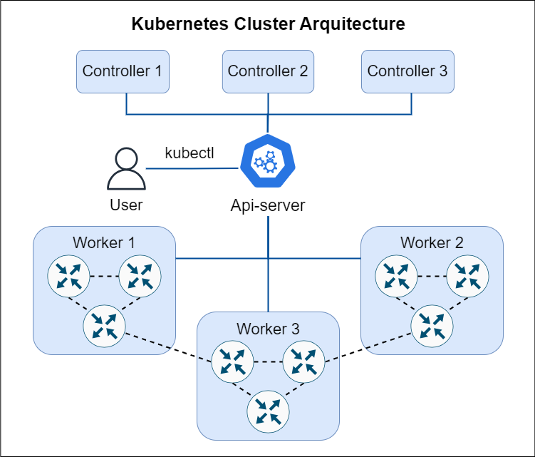
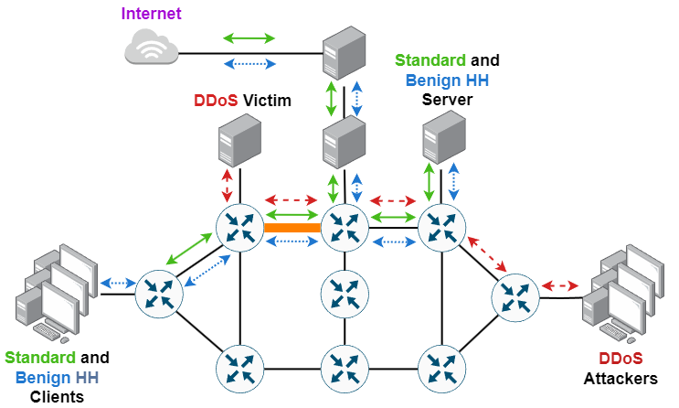

# Codebase of the paper: “On the Applicability of Network Digital Twins in Generating Synthetic Data for Heavy Hitter Discrimination”

## Table of Contents

1. [Abstract](#abstract)
2. [Repository Overview](#repository-overview)
3. [System Architecture](#system-architecture)
4. [Installation](#installation)
5. [Usage](#usage)
6. [Experimental Setup](#experimental-setup)
    - [Data Generation](#data-generation)
    - [Scenario Configuration and Deployment](#scenario-configuration-and-deployment)
    - [Data Collection, Preprocessing, and Labeling](#data-collection-preprocessing-and-labeling)
7. [Machine Learning Model Development and Evaluation](#machine-learning-model-development-and-evaluation)
8. [Solution Deployment](#solution-deployment)
9. [APIs](#apis)
10. [Message Formats](#message-formats)
11. [Logging and Monitoring](#logging-and-monitoring)
12. [Environment Variables](#environment-variables)
13. [File Structure](#file-structure)
14. [Reproducibility](#reproducibility)
15. [Citation](#citation)
16. [Contact](#contact)

---

## Abstract

This repository accompanies the paper titled "**On the Applicability of Network Digital Twins in Generating Synthetic Data for Heavy Hitter Discrimination**," which is currently under review on a peer-reviewed journal.

The study presents an NDT framework designed to emulate realistic network environments for generating labeled synthetic traffic data for developing machine learning models. The framework is validated through a novel use case involving heavy hitter discrimination, both benign and malicious (e.g., DDoS attacks). The framework leverages orchestration technologies and automated deployment workflows to ensure reproducibility, extensibility and scalability to facilitate network security research and experimentation.

Co-authors: **Amit Karamchandani, Alberto Mozo, Luis de la Cal** (Universidad Politécnica de Madrid); **Javier Nuñez, Yenny Moreno, Antonio Pastor** (Telefónica Innovación Digital).

With special support from **Diego R. López** (Telefónica Innovación Digital).

---

## System Architecture

The system architecture is composed of interconnected Docker containers orchestrated via Docker Compose. The architecture leverages Elasticsearch for model cataloging, Kafka for data streaming, and Grafana for monitoring. Below is an overview of the key components and their interactions.

### Key Components

1. **Network Digital Twin (NDT)**: Creates a virtual replica of a real network environment, enabling the generation of extensive and labeled synthetic traffic data suitable for training production-ready ML models for diverse network use cases.
2. **Traffic Generators**: Emulate standard, benign heavy hitter, and malicious heavy hitter (DDoS) traffic.
3. **Data Collection Modules**: Capture network traffic using NFstream and preprocess data into flow snapshots.
4. **Machine Learning Pipeline**: Train and evaluate Random Forest classifiers for traffic classification.
5. **Messaging Bus (Kafka)**: Facilitates communication between components, enabling scalable data streaming.
6. **Monitoring Dashboard (Grafana)**: Visualizes network traffic and ML model performance metrics in real-time.
7. **AI Training Service**: Trains machine learning models using collected and preprocessed data.
8. **AI Detector**: Assigns final classifications based on inference probabilities, using a separate pre-built image.

### Architecture Overview


The above figure illustrates the general architecture. The Mouseworld NDT generates live raw traffic received by the AI Data Aggregator through a customizable number of flow aggregators, ensuring scalability. This raw traffic is aggregated into traffic features and sent through a Kafka bus to the AI Inference component, which is also scalable through replicas. The AI Inference component processes the features using an ML model and outputs the probability of the traffic belonging to each class: normal traffic, benign heavy hitter, and malicious DDoS traffic. These probabilities are sent through the Kafka bus to the AI Detector component, which assigns the final class to each flow based on the probabilities. Currently, the class with the highest probability is assigned, but the system is designed to accept custom thresholds to reduce false positives or negatives for specific classes. Finally, the assigned classes are sent through the Kafka bus to a monitoring client that aggregates the results into a custom Grafana dashboard, providing an easy-to-monitor view of the network state and ML model performance.

---

## Installation

### Requirements

Before setting up the framework, ensure that your system meets the following requirements:

#### AI Detector Software Requirements

- **Operating System**: Linux-based OS (e.g., Ubuntu 20.04 LTS)
- **Docker**: Version 20.10 or higher
- **Docker Compose**: Version 1.29 or higher
- **Python**: Version 3.8 or higher
- **Git**: Version 2.25 or higher

---

#### NDT Hardware Specifications
The NDT has been tested on the following hardware configuration:

##### Hardware Components List

| Component               | Model                      | Quantity |
|-------------------------|----------------------------|----------|
| Processor               | Dell Intel Xeon Gold 5318N | 2        |
| RAM                     | DDR4-2666                  | 2        |
| SSD                     | Dell Intel Xeon Gold 5318N | 2        |
| Optical Network Module  | Dell EMC PowerEdge         | 2        |
| Server Hardware         | Dell Intel Xeon Gold 5318N | 2        |

##### Server Hardware Specification

| Component        | Specification    |
|------------------|------------------|
| Vendor           | Dell             |
| Model            | PowerEdge R750   |
| RAM              | 2 TB DDR4        |
| CPUs             | 2                |
| Cores            | 64               |
| Threads          | 128              |
| Storage          | 21 TB SSD        |
| Read/Write Speed | 550/520 MB/s     |

##### Processor Specification

| Component | Specification           |
|-----------|-------------------------|
| Vendor    | Dell                    |
| Model     | Intel Xeon Gold 5318N   |
| Cores     | 24                      |
| Threads   | 48                      |
| Base Speed| 2.1 GHz                 |
| Cache     | 36 MB                   |
| TDP       | 150 W                   |

##### Optical Network Module Specification

| Component              | Specification |
|------------------------|---------------|
| Vendor                 | Dell          |
| Model                  | PowerEdge     |
| Type                   | SFP           |
| SPEED                  | 10GBE         |
| Optical Wavelength     | 850NM         |

##### RAM Specification

| Component      | Specification |
|----------------|---------------|
| Type           | DDR4-2666     |
| Capacity       | 32 GB         |
| Speed          | 3200 MT/s     |
| Mode           | Dual rank     |
| Base Capacity  | 216 Gb        |

##### SSD Specification

| Component      | Specification |
|----------------|---------------|
| Capacity       | 1.92 TB       |
| Interface      | vSAS          |
| Transfer Speed | 12 Gb/s       |

---

#### NDT Software Infrastructure

| Name               | Version | Nodes Number | SO                 | RAM   | vCPUs |
| ------------------ | ------- | ------------ | ------------------ | ----- | ----- |
| Kubernetes Cluster | 1.27.3  | 4            | Ubuntu 20.04.6 LTS | 10 GB | 8     |

##### Nodes Details of the Kubernetes Cluster

| Node            | CPUs | RAM (GB) | Storage (GB) | Version |
|-----------------|------|----------|--------------|---------|
| control-plane 1 | 8    | 10       | 60           | 1.27.3  |
| control-plane 2 | 8    | 8        | 90           | 1.27.4  |
| control-plane 3 | 8    | 8        | 60           | 1.27.5  |
| worker 1        | 16   | 60       | 130          | 1.27.6  |
| worker 2        | 16   | 60       | 150          | 1.27.7  |
| worker 3        | 16   | 60       | 150          | 1.27.8  |
| worker 4        | 32   | 475      | 5324.8       | 1.27.9  |
| HAProxy         | 8    | 10       | 75           | 2.0.31  |

---

##### Compute Infrastructure Services

| Service Type                      | Service Description                                                                            | Technology Type         | Version               | Provided By          |
| --------------------------------- | ---------------------------------------------------------------------------------------------- | ----------------------- | --------------------- | -------------------- |
| Kubernetes Network Emulator (KNE) | Standard "interface" for vendors to produce a container implementation for complex topologies. | Network emulator        | 0.1.15                | OpenConfig           |
| MetalLB                           | Network load-balancer implementation within the Kubernetes cluster.                            | Load Balancer           | 0.13.12               | The Linux Foundation |
| Docker                            | Open-source containerization technology for building and containerizing applications.          | Container run interface | 20.10.21              | Docker, Inc.         |
| Vrnetlab                          | Tool to convert and import router images into containerized images in Docker.                  | Router Images converter | 0.12.1                | Deutsche Telekom     |
| Arista cEOS Router                | Emulated Arista cEOS routers for network topology                                              | Router Emulator         | v4.32F                | Arista               |
| Ansible                           | NDT scenario configuration and deployment software                                             | Automation Software     | Version 2.9 or higher |                      |

Ensure that all dependencies are correctly installed and configured before proceeding with the deployment of the framework. The specified hardware and software setup has been used to validate the framework's performance and reliability.

### Step-by-Step Installation Guide

1. **Clone the Repository**
    
    ```bash
    git clone https://github.com/MMB-UPM/hh_detection
    cd hh_detection
    ```
    
2. **Set Up Docker Images**
    
    Build the Docker images required for each service.
    
    ```bash
    # Build ai-catalog image
    cd ai-catalog
    docker build -t ai-catalog:latest .
    cd ..
    
    # Build ai-inference image
    cd ai-inference
    docker build -t ai-inference:latest .
    cd ..
    
    # Build ai-training image
    cd ai-training
    docker build -t ai-training:latest .
    cd ..
    
    # Build ai-detector image
    cd ai-detector
    docker build -t ai-detector:latest .
    cd ..
    
    # Build data_aggregator image
    cd data_aggregator/data_aggregator
    ./build.sh
    cd ../../../
    
    # Build model-upload image
    cd model-upload
    docker build -t model-upload:latest .
    cd ..
    
    # Build ai-monitoring image
    cd ai-monitoring
    docker build -t ai-monitoring:latest .
    cd ..
    ```
    
3. **Configure Docker Compose**
    
    The `docker-compose.yml` file orchestrates the deployment of all services. Ensure that the ports specified do not conflict with existing services on your host machine.
    
4. **Deploy the Services**
    
    From the root directory of the repository, run:
    
    ```bash
    docker-compose up -d
    ```
    
    This command will build (if not already built) and start all services in detached mode.
    
5. **Verify Deployment**
    
    Check the status of all services to ensure they are running correctly.
    
    ```bash
    docker-compose ps
    ```
    
    You should see all services listed as `Up`.

---

## **Data Generation**

The following tools were utilized for data generation in this project:

### **Benign Traffic**
- **Selenium** – A suite of tools for automating web browsers, used for generating network traffic through user interaction emulation. [Official Website](https://www.selenium.dev)
- **Wget** – A command-line utility for downloading files from the web, mimicking real-world traffic behavior. [GNU Wget](https://www.gnu.org/software/wget/)
- **SCP** – A command-line tool for secure file transfer between hosts. [SCP Command](https://linux.die.net/man/1/scp)
- **dig (Domain Information Groper)** – A command-line tool for querying DNS name servers, used to emulate legitimate DNS queries. [dig Command](https://linux.die.net/man/1/dig)
- **aria2** – A lightweight, multi-protocol, and multi-source command-line download utility for high-volume traffic generation, emulating P2P traffic. [Official Website](https://aria2.github.io)
- **Custom Client-Server Applications** – Developed in-house to create random high-volume traffic bursts, simulating various network conditions.
- **YouTube** – A video-sharing platform used as a source for streaming data, mimicking legitimate heavy hitter traffic. [Official Website](https://www.youtube.com)
- **Twitch** – A live streaming platform used for emulating media-rich traffic sources. [Official Website](https://www.twitch.tv)

### **Malicious Heavy Hitter (DDoS Attacks)**
- **hping3** – A network tool for sending custom TCP/IP packets and analyzing network behavior, used for generating IP, TCP, and UDP floods. [GitHub Repository](https://github.com/antirez/hping)
- **Vegeta** – A versatile HTTP load testing tool, used to execute HTTP floods. [GitHub Repository](https://github.com/tsenart/vegeta)
- **Custom C Tools** – Developed in-house to implement DNS amplification and water torture attacks, targeting DNS infrastructure.
- **Python Scripts** – Utilized for developing DNS over HTTPS (DoH) flood attacks, enabling the study of encrypted DNS traffic under attack scenarios.
- **SYN Flood – Employed to emulate TCP-SYN flood attacks, testing the resilience of network defenses against such threats. [GitHub Repository](https://github.com/TheFox/synflood)

###
We have designed MouseWorld as a Network Digital Twin (NDT) platform to provide a controlled and reproducible environment for network experimentation, directly supporting the objectives of our research. Aligned with the IETF NDT architecture, MouseWorld leverages Kubernetes Network Emulation (KNE) to create scalable, multi-vendor network topologies and uses Ansible for automated deployment, ensuring flexibility and repeatability in experimentation.

To address the challenges of data scarcity in AI-driven network research, we designed MouseWorld to generate synthetic traffic that accurately replicates real-world user behavior. This enables the creation of high-fidelity datasets for training and validating ML models in network performance optimization and security analysis.

MouseWorld is deployed on a Kubernetes cluster comprising three control nodes and three worker nodes. The control nodes manage cluster operations and ensure resource allocation, while the worker nodes host network emulation instances. Each worker node is equipped with Docker container runtime and Kubernetes networking components to support high-performance traffic processing. The deployment integrates Kubernetes Network Emulation (KNE) for orchestrating virtualized network devices, enabling multivendor emulation with support for Arista, Cisco, Juniper, and Nokia devices. Traffic data is collected and stored for analysis, with results visualized in Grafana for monitoring and evaluation.



## Scenario Configuration and Deployment

The [scenario](Figures/topology.png) was implemented using the KNE platform within Mouseworld NDT, incorporating routers, clients, and servers. A total of 30 clients were deployed in this scenario. Among these, 21 clients are configured to emulate benign traffic, while the remaining 9 clients are designed to emulate DDoS attacks. Below the diagram of the topology is provided:



### Network Topology and Traffic Routing
The scenario employs Arista’s cEOS 4.32.1F image to emulate routers with predefined configurations. Ten interconnected routers form the topology's core, linking all clients and managing traffic to designated endpoints. Two traffic types are generated, each following a distinct route through the network. The topology was designed so that all traffic classes converge on a single core link (highlighted in orange in the figure). This design choice emulates a typical production network environment where mixed traffic types flow through common links in the core of a network, essential for training a reliable ML model by enabling it to learn discriminative patterns among diverse traffic types on a shared path. Network probes are deployed in all network links to capture traffic data in PCAP files.

### Configuration of Clients and Servers

The client environment is based on a customized Docker image derived from "Ubuntu 18.04." The primary modifications to this image involve the installation of specific packages and libraries required to execute various network attacks effectively. Two distinct Docker images were developed: one for generating benign traffic and another dedicated to generating DDoS attack traffic. For the servers, two separate Docker images based on "Ubuntu 20.04" were configured. The first image is designed to serve as an authoritative DNS server, as well as processing attack-related queries and enabling execution of HTTP flood and DoH attacks. The second server image is configured for client-server socket communication using netcat and serves as the target server for non-attack, benign traffic.

### Automated Scenario Deployment with Ansible
To ensure reproducibility and scalability, the entire topology and traffic emulation environment are deployed using **Infrastructure-as-Code (IaC) methodologies**:  

- **Ansible Playbooks** – Used to automate the deployment of routers, client configurations, and monitoring tools.  
- **Docker Containers** – Ensure isolation of services and seamless execution across different environments.  
- **Kubernetes-based Orchestration** – Supports service management, scalability, and automated recovery of failed components.

Using Ansible, the deployment of the scenario was automated within the lab's Kubernetes cluster. The repository includes the following Ansible playbooks located in the `ansible-playbooks/` directory:

- **mw-deployment.yaml**: Deploys the network topology using KNE, sets up necessary configurations, and initializes the "gateway2" pod.
- **mw-config.yaml**: Configures the deployed pods based on the number of clients specified, sets up routing, initiates traffic captures using nfstream, and initializes essential services like `Bind9` and the Caddy web server.
- **mw-tasks.yaml**: Declares and runs the traffic generators on the deployed clients, allowing customization of execution time and the number of clients involved.
- **mw-undeployment.yaml**: Cleans up the entire deployment by stopping traffic captures, transferring logs to the host machine, and removing all deployed components.

A Python script is provided in the `scripts/` directory to automate the sequential execution of these Ansible playbooks. This script prompts the user to specify the number of clients for each traffic type, facilitating flexibility in configuring the environment for various experimental requirements.

---

### Data Collection, Preprocessing, and Labeling

An order of 23.7 million packets were collected from the network link analyzed for each of the two NDT scenario executions. For feature extraction, custom plugins on top of the **NFStream** tool were developed to perform flow packet grouping in 0.5-second intervals, extracting several relevant statistical features of the network flows. These aggregated flow statistics are referred to as **snapshots**. The feature set includes:

- **Protocol Type**: TCP, UDP, ICMP, etc.
- **Flow Duration**: Time between the first and last packet in both directions.
- **Packet Counts**: Total packets with payload in both directions.
- **Byte Counts**: Total bytes transmitted in both directions.
- **Time Discrepancy**: Difference in observation times between source and destination.
- **Packets per Second**: Number of packets transmitted per second in both directions.
- **Bytes per Second**: Number of bytes transmitted per second in both directions.

Additionally, the **data_aggregator** component can output labeled CSV files for use in training, validation, and testing machine learning models. Labels are assigned based on the known traffic generation sources, facilitating supervised learning.

Finally, labels were assigned to the data based on the nature of each traffic flow for supervised machine learning applications.

To facilitate reproducibility and support further research, several datasets generated from variations of the described NDT scenario, each specifically prepared for different experimental setups, are openly available at [DATASET_URL](https://github.com/yourusername/across-tc-3.5-network-detection/datasets). The dataset used in this study was obtained through post-processing code applied to these variations.

All traffic generation scripts are located in the `traffic-generators/` directory, providing comprehensive tools to emulate various traffic patterns as described above.

---

## Machine Learning Model Development and Evaluation

### Feature Selection

Custom plugins were developed on top of the **NFStream** tool to extract relevant statistical features from network flows. The feature set includes protocol type, flow duration, packet and byte counts, time discrepancies, and transmission rates, among others. These features are crucial for effectively discriminating between different traffic classes.

### Model Training, Validation, and Testing

A **Random Forest** classifier was selected due to its robustness and proven performance in similar tasks.

#### Dataset

- **Training Set**: 7.5 million connection snapshots from one scenario run.
- **Validation Set**: 1.0 million connection snapshots from a separate scenario run.
- **Testing Set**: 7.9 million connection snapshots from another separate scenario run.

#### Model Configuration

- **Number of Estimators**: 20 (optimal trade-off between performance and speed).
- **Evaluation Metrics**: Precision, Recall, and F1-Score.

#### Training Process

Execute the training script with the specified configuration:

```bash
docker-compose up -d ai-training
```

This command starts the AI Training service, which consumes preprocessed traffic data from Kafka, trains the Random Forest classifier using `train.py`, and uploads the trained model to the ai-catalog for inference.

#### Evaluation Results

|Class|Precision|Recall|F1-Score|
|---|---|---|---|
|Normal Traffic|0.9737|0.9961|0.9848|
|Heavy Hitter|0.6858|0.9027|0.7795|
|DDoS Attack|0.9998|0.9946|0.9972|
|**Macro Avg.**|0.8864|0.9645|0.9205|
|**Weighted Avg.**|0.9950|0.9947|0.9948|

**Confusion Matrix:**

||Predicted Normal|Predicted Heavy Hitter|Predicted DDoS Attack|
|---|---|---|---|
|**Normal Traffic**|1.3e+06|978|35,076|
|**Heavy Hitter**|3,848|9,585|543|
|**DDoS Attack**|1,386|55|6.6e+06|

### Analysis

The model demonstrates high precision and recall for both Normal Traffic and DDoS Attack classes, indicating effective classification. The lower F1-Score for the Heavy Hitter class suggests some misclassifications, primarily between benign heavy hitters and normal traffic. However, in cybersecurity applications, minimizing false negatives is often prioritized to ensure threats are not overlooked.

### Training and Testing Code

All scripts related to model training and evaluation are available in the `ai-training/` and `ml_model/` directories. To reproduce the training process:

```bash
cd ai-training
python train.py --config config.yaml
```

Ensure that the training and testing datasets are correctly specified in the configuration file.

---

## Heavy Hitter Detector Deployment

### Components


1. **AI Data Aggregator**:
    
    - **Purpose**: Receives raw traffic data from the Mouseworld NDT through a customizable number of flow aggregators, allowing for scalability.
    - **Configuration**: Managed via Docker Compose and integrated with Kafka for data streaming.
2. **Kafka Bus**:
    
    - **Purpose**: Acts as the messaging backbone, enabling communication between data producers (data aggregator) and consumers (AI inference and AI detector).
    - **Configuration**: Configured with multiple listeners for internal and external communication.
3. **AI Inference Component**:
    
    - **Purpose**: Processes aggregated features using the trained ML model to predict traffic classes.
    - **Functionality**: Consumes data from Kafka, applies the Random Forest model, and produces classification probabilities back to Kafka.
4. **AI Detector Component**:
    
    - **Purpose**: Assigns final classes based on model probabilities using a separate pre-built image.
    - **Functionality**: Consumes classification probabilities from Kafka, determines the final traffic class based on predefined thresholds, and publishes the results.
    - **Deployment**: Deployed as a separate service via Docker Compose, assuming the image is already available in the repository.
5. **Monitoring Client**:
    
    - **Purpose**: Collects and visualizes results on a Grafana dashboard for real-time monitoring.
    - **Functionality**: Aggregates classification results and displays metrics such as traffic volume, unique connections, and attack detections.
6. **AI Training Service**:
    
    - **Purpose**: Trains machine learning models using collected and preprocessed data.
    - **Functionality**: Consumes training data from Kafka, trains the ML model using `train.py`, and uploads the trained model to the ai-catalog.

### Deployment Steps

All services are deployed using Docker Compose. Follow the streamlined steps below to deploy the entire detection system.

1. **Deploy All Services via Docker Compose**  
   From the root directory of the repository, run:  
   ```bash
   docker-compose up -d
   ```  
   This command will build (if not already built) and start all services, including `ai-catalog`, `ai-inference`, `ai-training`, `ai-detector`, `data_aggregator`, `model-upload`, `kafka`, and `ai-monitoring`, in detached mode.

2. **Verify Deployment**  
   Check the status of all services to ensure they are running correctly:  
   ```bash
   docker-compose ps
   ```  
   You should see all services listed as `Up`.

3. **Access Services**  
   - **Elasticsearch (ai-catalog)**: `http://localhost:9200`  
   - **Kafka**: Accessible on ports `9094` (External) and `9092` (Internal)  
   - **AI Inference**: Handles data classification  
   - **AI Detector**: Assigns final classes based on inference probabilities  
   - **AI Training**: Trains ML models using `train.py`  
   - **Grafana (ai-monitoring)**: `http://localhost:3000`

4. **Access Grafana Dashboard**  
   Open your browser and navigate to `http://localhost:3000`. Log in with the default credentials (`admin/admin`) and configure your dashboards to visualize relevant metrics.

5. **Customizing Thresholds**  
   The AI Detector component allows customization of thresholds to balance false positives and negatives. Modify the `thresholds.yaml` file to set class-specific confidence levels:  
   ```yaml
   thresholds:
     Normal Traffic: 0.95
     Heavy Hitter: 0.80
     DDoS Attack: 0.99
   ```  
   Apply the changes:  
   ```bash
   docker-compose restart ai-detector
   ```

6. **Stopping Services**  
   If you need to stop the system:  
   ```bash
   docker-compose down
   ```  
   This command stops all running containers. For a clean restart, it is essential to delete volumes associated with the services:  
   ```bash
   docker-compose down --volumes
   ```  
   Deleting volumes ensures a clean slate for data storage, avoiding potential conflicts or residual data from previous deployments.

### Grafana Dashboard

The Grafana dashboard provides real-time visualization of network traffic and ML model performance. Key metrics include:

- **Traffic Volume**: Incoming and outgoing packets and bytes per class.
- **Unique Connections**: Number of unique malign and benign heavy hitter connections.
- **System Security**: Instances of detected attacks.
- **ML Confidence**: Average confidence on the ML predictions.


### Accessing and Printing Logs

Detailed logs are essential for tracing system behavior and diagnosing issues. Follow the instructions below to access logs for each component.

1. **Identify the Container**
    
    List all running containers to find the specific container name.
    
    ```bash
    docker-compose ps
    ```
    
2. **Access Logs**
    
    Use Docker Compose to view logs for a specific service.
    
    ```bash
    docker-compose logs -f <service-name>
    ```
    
    For example, to view logs for the `data_aggregator` service:
    
    ```bash
    docker-compose logs -f data_aggregator
    ```
    
3. **Stream Logs in Real-Time**
    
    To continuously stream logs, use the `-f` (follow) flag as shown above.

#### Log Aggregation

Logs from all components are aggregated and stored locally within each container. While advanced log management and visualization can be achieved using tools like the ELK Stack (Elasticsearch, Logstash, Kibana), direct log ingestion and analysis through ELK is not currently provided in this repository. However, integration with Elasticsearch is supported through the ai-catalog service for those who wish to set up their own ELK environment.

---

## APIs

The **ai-*** components expose APIs for interacting with various functionalities such as model inference, training, and monitoring. Below is a detailed description of each component's APIs.

### AI Inference API

The AI Inference component processes incoming traffic data and classifies it using pre-trained machine learning models. It interacts primarily through Kafka topics for data ingestion and result publication.

#### Endpoints

- **Model Management**
    
    - **GET /models**
        - **Description**: Retrieves a list of available models from the ai-catalog.
        - **Parameters**: None
        - **Response**: JSON array of model metadata.
    - **POST /models/{model_id}**
        - **Description**: Loads a specific model by its ID from the ai-catalog.
        - **Parameters**:
            - `model_id` (path parameter): The ID of the model to load.
        - **Response**: JSON status message indicating success or failure.
- **Inference Operations**
    
    - **POST /infer**
        - **Description**: Triggers the inference process for a batch of traffic data.
        - **Parameters**:
            - **Body**: JSON array of traffic flow snapshots.
        - **Response**: JSON array of classification probabilities for each traffic flow.

#### Authentication

Currently, the AI Inference API does not implement authentication. Future iterations may include authentication mechanisms to secure the endpoints.

### AI Training API

The AI Training component handles the training of machine learning models using collected and preprocessed traffic data.

#### Endpoints

- **Training Operations**
    
    - **POST /train**
        - **Description**: Initiates the training process using the provided dataset.
        - **Parameters**:
            - **Body**: JSON object containing training configuration parameters.
        - **Response**: JSON status message indicating the initiation of training.
- **Model Retrieval**
    
    - **GET /trained-models**
        - **Description**: Retrieves a list of trained models available in the ai-catalog.
        - **Parameters**: None
        - **Response**: JSON array of trained model metadata.

#### Authentication

Currently, the AI Training API does not implement authentication. Future iterations may include authentication mechanisms to secure the endpoints.

### AI Detector API

The AI Detector component assigns final classifications based on inference probabilities.

#### Endpoints

- **Classification Operations**
    - **POST /detect**
        - **Description**: Assigns final classes to traffic flows based on inference probabilities and predefined thresholds.
        - **Parameters**:
            - **Body**: JSON array of classification probabilities.
        - **Response**: JSON array of final traffic classifications.

#### Authentication

Currently, the AI Detector API does not implement authentication. Future iterations may include authentication mechanisms to secure the endpoints.

### Model Upload API

The Model Upload component provides an interface for uploading trained machine learning models to the ai-catalog.

#### Endpoints

- **Model Upload**
    - **POST /upload**
        - **Description**: Uploads a trained model along with its metadata to the ai-catalog.
        - **Parameters**:
            - **Body**: JSON object containing the model file (base64 encoded) and metadata.
        - **Response**: JSON status message indicating success or failure of the upload.

#### Authentication

Currently, the Model Upload API does not implement authentication. Future iterations may include authentication mechanisms to secure the endpoints.

---

## Message Formats

Communication between the **ai-*** components and other services primarily occurs through Kafka messages. Below is a detailed description of the message formats used in the system.

### Kafka Topics

1. **inference_data**:
    
    - **Description**: Topic from which the AI Inference service consumes traffic data for classification.
    - **Producer**: `data_aggregator`
    - **Consumer**: `ai-inference`
2. **inference_probs**:
    
    - **Description**: Topic to which the AI Inference service publishes classification probabilities.
    - **Producer**: `ai-inference`
    - **Consumer**: `ai-detector`, `ai-monitoring`
3. **training_data**:
    
    - **Description**: Topic from which the AI Training service consumes preprocessed traffic data for model training.
    - **Producer**: `data_aggregator`
    - **Consumer**: `ai-training`
4. **model_upload**:
    
    - **Description**: Topic to which the Model Upload service publishes information about uploaded models.
    - **Producer**: `model-upload`
    - **Consumer**: `ai-catalog`

### Message Schemas

#### Inference Data Messages (`inference_data`)

- **Schema**:
    ```json
    {
      "data": {
        "features": {
          "protocol_type": "TCP",
          "flow_duration": 30.5,
          "packet_counts": 150,
          "byte_counts": 20480,
          "time_discrepancy": 0.2,
          "packets_per_second": 5.0,
          "bytes_per_second": 682.6667
        }
      },
      "metadata": {
        "timestamp": 1617181723.456,
        "timestamp_data_aggregator": 1617181723.500,
        "monitored_device": "eth0",
        "interface": "ens3",
        "connection_id": {
          "src_ip": "192.168.1.10",
          "dst_ip": "192.168.1.20",
          "src_port": "12345",
          "dst_port": "80",
          "protocol": "TCP",
          "first": 1617181723.456
        },
        "flow_pkts": 150,
        "flow_bytes": 20480
      }
    }
    ```
- **Headers**:
    - `version`: Indicates the version of the message format (e.g., `v1`, `v2`, etc.).
    - `features`: Comma-separated list of feature names included in the message.

#### Inference Probabilities Messages (`inference_probs`)

- **Schema**:
    ```json
    {
      "data": [
        {
          "Normal Traffic": 0.95,
          "Heavy Hitter": 0.05,
          "DDoS Attack": 0.00
        },
        {
          "Normal Traffic": 0.10,
          "Heavy Hitter": 0.85,
          "DDoS Attack": 0.05
        }
      ],
      "metadata": [
        {
          "src_ip": "192.168.1.10",
          "dst_ip": "192.168.1.20",
          "src_port": "12345",
          "dst_port": "80",
          "timestamp_data_aggregator": 1617181723.500,
          "timestamp_before_process": 1617181723.550,
          "timestamp_after_process": 1617181723.600,
          "timestamp_inference": 1617181723.700,
          "flow_bytes": 20480,
          "flow_pkts": 150,
          "monitored_device": "eth0",
          "interface": "ens3"
        },
        {
          "src_ip": "192.168.1.11",
          "dst_ip": "192.168.1.21",
          "src_port": "12346",
          "dst_port": "80",
          "timestamp_data_aggregator": 1617181723.510,
          "timestamp_before_process": 1617181723.560,
          "timestamp_after_process": 1617181723.610,
          "timestamp_inference": 1617181723.710,
          "flow_bytes": 10240,
          "flow_pkts": 100,
          "monitored_device": "eth0",
          "interface": "ens3"
        }
      ]
    }
    ```
- **Headers**:
    - `version`: Indicates the version of the inference process.

#### AI Detector Messages (`final_classifications`)

- **Schema**:
    ```json
    {
      "data": [
        {
          "classification": "DDoS Attack",
          "confidence": 0.99
        },
        {
          "classification": "Heavy Hitter",
          "confidence": 0.85
        }
      ],
      "metadata": [
        {
          "src_ip": "192.168.1.10",
          "dst_ip": "192.168.1.20",
          "src_port": "12345",
          "dst_port": "80",
          "timestamp_detector": 1617181724.456,
          "detector_thresholds": {
            "Normal Traffic": 0.95,
            "Heavy Hitter": 0.80,
            "DDoS Attack": 0.99
          }
        },
        {
          "src_ip": "192.168.1.11",
          "dst_ip": "192.168.1.21",
          "src_port": "12346",
          "dst_port": "80",
          "timestamp_detector": 1617181724.560,
          "detector_thresholds": {
            "Normal Traffic": 0.95,
            "Heavy Hitter": 0.80,
            "DDoS Attack": 0.99
          }
        }
      ]
    }
    ```
- **Headers**:
    - `version`: Indicates the version of the detector process.

#### Model Upload Messages (`model_upload`)

- **Schema**:
    ```json
    {
      "file_data": {
        "filename": "random_forest_model.joblib",
        "file_content": "base64_encoded_content_here",
        "content_type": "file/joblib"
      },
      "metadata": {
        "name": "Random Forest Model v1",
        "params": {
          "n_estimators": 20,
          "max_depth": 10,
          "random_state": 42
        },
        "cv_acc": 0.95
      }
    }
    ```
- **Protocol**:  
  - HTTP POST for upload, using the model file bytes as the body. Metadata is included as part of the request body.

#### Model Management Messages (`model_management`)

Model management operations are performed using HTTP requests to the Elasticsearch-based ai-catalog.

- **Upload**:
    - **Method**: POST
    - **Endpoint**: `/models/upload`
    - **Body**:
        ```json
        {
          "file_data": {
            "filename": "model.joblib",
            "file_content": "base64_encoded_model_bytes"
          },
          "metadata": {
            "model_name": "Random Forest v1",
            "description": "Traffic classifier for network detection",
            "hyperparameters": {
              "n_estimators": 50,
              "max_depth": 20
            },
            "training_accuracy": 0.92
          }
        }
        ```
- **Download**:
    - **Method**: POST
    - **Endpoint**: `/models/download`
    - **Body**:
        ```json
        {
          "model_id": "unique_model_id"
        }
        ```
- **Delete**:
    - **Method**: POST
    - **Endpoint**: `/models/delete`
    - **Body**:
        ```json
        {
          "model_id": "unique_model_id"
        }
        ```
---

## Environment Variables

Below is a comprehensive list of all relevant custom environment variables used across different services in the detection system:

### AI Training

- `KAFKA_URL="localhost:9094"`
- `CATALOG_URL="localhost:9200"`
- `TRAINING_DATA_TOPIC="training_data"`
- `MODEL_OUTPUT_PATH="./models/"`
- `TZ="Europe/Madrid"`

### AI Catalog

- `CATALOG_URL="http://localhost:9200"`
- `CATALOG_INDEX="models"`
- `MODELS_PATH="./models/rev3/"`
- `MODEL="random_forest_train_ceos2_eth4_29_final_10estimators.joblib"`
- `TZ="Europe/Madrid"`

### Data Aggregator

- `FEATURE_IDS`: Comma-separated list of feature indices to extract.
- `TOPIC="inference_data"`
- `WINDOW_SIZE=10`
- `PROTOCOL="TCP"`
- `VERSION="v1"`
- `INTERVAL_SECONDS=1`
- `NUM_CONNECTIONS=300`
- `TIMEOUT=5.0`
- `MODE="streaming"` | `static`
- `BROKER_IP_ADDRESS="localhost"`
- `BROKER_PORT="9094"`
- `NFSTREAM_DIR_NAME="/nfstream/plugins/"`
- `IGNORE_FIRST_LINE_NFSTREAM=True`
- `MONITORED_DEVICE="eth0"`
- `INTERFACE="ens3"`

### AI Inference

- `KAFKA_URL="localhost:9094"`
- `CATALOG_URL="localhost:9200"`
- `CONSUMER_TOPIC="inference_data"`
- `PRODUCER_TOPIC="inference_probs"`
- `CONSUMER_CLIENT_ID="ai-inference-consumer"`
- `PRODUCER_CLIENT_ID="ai-inference-producer"`
- `CONSUMER_GROUP_ID="ai-inference"`
- `CATALOG_MODELS_INDEX="models"`
- `LOAD_MODEL="None"`
- `TZ="Europe/Madrid"`

### AI Detector

- `KAFKA_URL="localhost:9094"`
- `DETECTOR_TOPIC="inference_probs"`
- `OUTPUT_TOPIC="final_classifications"`
- `THRESHOLDS_CONFIG="/config/thresholds.yaml"`
- `TZ="Europe/Madrid"`

### AI Monitoring

- `GF_SECURITY_ADMIN_PASSWORD=admin` (Grafana)

---

## Repository Organization

```
across-tc-3.5-network-detection/
├── ai-catalog
│   └── Dockerfile
├── ai-inference
│   ├── files
│   │   └── requirements.txt
│   ├── Dockerfile
│   └── ai_inference.py
├── ai-monitoring
│   └── Dockerfile
├── ai-training
│   ├── files
│   │   └── requirements.txt
│   ├── Dockerfile
│   └── train.py
├── ai-detector
│   ├── Dockerfile
│   └── ai_detector.py
├── data_aggregator
│   ├── data_aggregator
│   │   ├── nfstream
│   │   │   └── plugins
│   │   │       ├── plugin1.py
│   │   │       ├── plugin2.py
│   │   │       └── ... (additional custom nfstream plugins)
│   │   ├── scripts
│   │   │   ├── data_aggregator.py
│   │   │   ├── entrypoint.sh
│   │   │   └── requirements.in
│   │   └── Dockerfile
│   ├── build.sh
│   ├── clean.sh
│   ├── log.sh
│   ├── run.sh
│   ├── start.sh
│   └── trash.sh
├── model-upload
│   ├── files
│   │   └── requirements.txt
│   ├── Dockerfile
│   └── model_upload.py
├── ansible-playbooks
│   ├── mw-deployment.yaml
│   ├── mw-config.yaml
│   ├── mw-tasks.yaml
│   └── mw-undeployment.yaml
├── traffic-generators
│   ├── benign/
│   │   ├── standard/
│   │   │   ├── browse_web.py
│   │   │   ├── download_files.py
│   │   │   └── ... (other standard traffic scripts)
│   │   ├── heavy_hitter/
│   │   │   ├── high_volume_traffic.py
│   │   │   └── ... (other benign heavy hitter scripts)
│   │   └── ... (additional benign traffic categories)
│   └── malign/
│       ├── heavy_hitter/
│       │   ├── ip_flood.py
│       │   ├── http_flood.py
│       │   └── ... (other malign heavy hitter scripts)
│       └── ... (additional malign traffic categories)
├── docker-compose.yml
├── README.md
├── requirements.in
└── Figures/
    ├── system_architecture.png
    ├── kubernetes_cluster.png
    ├── topology.png
    ├── ai_architecture.png
    └── dashboard.png
```

- **ai-catalog/**
    
    - **Dockerfile**: Builds an Elasticsearch instance configured for single-node operation without security features for simplicity.
- **ai-inference/**
    
    - **files/requirements.txt**: Lists Python dependencies required for the AI Inference service.
    - **Dockerfile**: Builds the AI Inference Docker image, installs dependencies, and sets environment variables for Kafka and Elasticsearch integration.
    - **ai_inference.py**: Main application script handling data consumption, inference, and result publication.
- **ai-monitoring/**
    
    - **Dockerfile**: Builds the custom Grafana image `ai-monitoring`, extending the base Grafana image with predefined dashboards and configurations.
- **ai-training/**
    
    - **files/requirements.txt**: Lists Python dependencies required for the AI Training service.
    - **Dockerfile**: Builds the AI Training Docker image, installs dependencies, and sets environment variables for Kafka and Elasticsearch integration.
    - **train.py**: Script responsible for training machine learning models using consumed data.
- **ai-detector/**
    
    - **Dockerfile**: Builds the AI Detector Docker image, installs dependencies, and sets environment variables for Kafka integration.
    - **ai_detector.py**: Script responsible for assigning final classifications based on inference probabilities.
- **data_aggregator/**
    
    - **nfstream/**
        - **plugins/**
            - **extract_flow_features.py**
            - **Description**: Contains custom nfstream plugins for extracting flow statistics tailored to the framework's requirements.
    - **scripts/**
        - **data_aggregator.py**: Main application script responsible for aggregating data using nfstream, preprocessing, and publishing to Kafka.
        - **entrypoint.sh**: Entry point script that initializes the data aggregation process.
        - **requirements.in**: Lists Python dependencies for the data aggregator.
    - **Dockerfile**: Builds the Data Aggregator Docker image, installs dependencies, and sets up necessary directories and environment variables.
- **data_aggregator/**
    - **build.sh**: Script to build the Data Aggregator Docker image.
    - **clean.sh**: Script to remove the Data Aggregator container.
    - **log.sh**: Script to view logs of the Data Aggregator container.
    - **run.sh**: Script to clean, build, and start the Data Aggregator.
    - **start.sh**: Script to start the Data Aggregator container with necessary environment variables.
    - **trash.sh**: Script to clean up dangling Docker images and prune networks.
- **model-upload/**
    - **files/requirements.txt**: Lists Python dependencies for the Model Upload service.
    - **Dockerfile**: Builds the Model Upload Docker image, installs dependencies, and sets environment variables for Elasticsearch integration.
    - **model_upload.py**: Script responsible for uploading trained models to the ai-catalog.
- **ansible-playbooks/**
    
    - **mw-deployment.yaml**: Deploys the network topology using KNE, sets up necessary configurations, and initializes the "gateway2" pod.
    - **mw-config.yaml**: Configures the deployed pods based on the number of clients specified, sets up routing, initiates traffic captures using nfstream, and initializes essential services like `Bind9` and the Caddy web server.
    - **mw-tasks.yaml**: Declares and runs the traffic generators on the deployed clients, allowing customization of execution time and the number of clients involved.
    - **mw-undeployment.yaml**: Cleans up the entire deployment by stopping traffic captures, transferring logs to the host machine, and removing all deployed components.
- **traffic-generators/**
    
    - **benign/**
        - **standard/**
            - **browse_web.py**: Automates web browsing using Selenium.
            - **download_files.py**: Automates file downloads using WGET and SCP.
            - **…**: Additional standard traffic generation scripts.
        - **heavy_hitter/**
            - **high_volume_traffic.py**: Generates high-volume benign traffic bursts.
            - **…**: Additional benign heavy hitter scripts.
        - **…**: Additional benign traffic categories.
    - **malign/**
        - **heavy_hitter/**
            - **ip_flood.py**: Generates IP flood attacks using hping3.
            - **http_flood.py**: Executes HTTP flood attacks using Vegeta.
            - **…**: Additional malign heavy hitter scripts.
        - **…**: Additional malign traffic categories.
- **docker-compose.yml**: Orchestrates the deployment of all services, including ai-catalog, ai-inference, ai-training, ai-detector, model-upload, kafka, data_aggregator, and ai-monitoring. Defines networks and volumes for data persistence.
    
- **requirements.in**: Root-level Python dependencies required for the entire project.
    
- **README.md**: This documentation file.
    
- **Figures/**
    
    - **system_architecture.png**: Diagram depicting the overall system architecture.
    - **kubernetes_cluster.png**: Diagram showing the high-level components of the Kubernetes cluster.
    - **topology.png**: Diagram illustrating the network topology.
    - **ai_architecture.png**: Diagram showing the AI components architecture.
    - **dashboard.png**: Screenshot of the Grafana Dashboard showing real-time traffic metrics classified by class, system security status and ML confidence.

---

## Reproducibility
All scripts and configurations required to replicate the experiments are included in this repository. This includes:
- **Traffic Generation Scripts**: Located in the `traffic-generators/` directory, separated into `benign/` and `malign/` subdirectories for clarity. Under `benign/`, there are further subcategories for `standard/` and `heavy_hitter/` traffic.
- **NDT Configuration and Deployment Playbooks**: Located in the `ansible-playbooks/` directory, containing `mw-deployment.yaml`, `mw-config.yaml`, `mw-tasks.yaml`, and `mw-undeployment.yaml` for automated scenario deployment and management.
- **NFStream Plugins**: Located in the `data_aggregator/data_aggregator/nfstream/plugins/` directory, containing custom plugins for flow statistics extraction.
- **Machine Learning Models Training and Inference Scripts**: Located in the `ai-inference/`, `ai-training/`, and `ml_model/` directories.
- **Attack Detector**: Located in the `ai-detector/` directory, with pre-built images and scripts for final classification.
- **Monitoring Dashboard**: Located in the `ai-monitoring/` directory, extending Grafana with custom dashboards.
- **Utility Scripts**: Located in the `scripts/` directories across various components for building, running, and managing services.

Ensure all components are correctly set up and configured as per the [Installation](#installation) and [Usage](#usage) sections.

### Datasets
To facilitate reproducibility and support further research, several datasets generated from variations of the described NDT scenario, each specifically prepared for different experimental setups, are openly available at [Zenodo](https://zenodo.org/records/14134646). The dataset used in this study was obtained through post-processing code applied to these variations.

---

## Citation

_This article is currently under review._

---

## Contact

For any inquiries, support, or contributions related to this repository, please contact:

- **Amit Karamchandani Batra**  
    **Email:** [amit.kbatra@upm.es](mailto:amit.kbatra@upm.es)  
    **Affiliation:** Universidad Politécnica de Madrid, Spain

---

**Disclaimer:** This repository is designed for academic and research purposes only. The authors assume no responsibility for any potential harm or misuse resulting from its use. Users are expected to comply with all applicable laws, regulations, and institutional guidelines when deploying or utilizing the tools and data provided herein.
